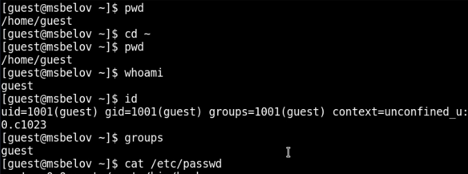
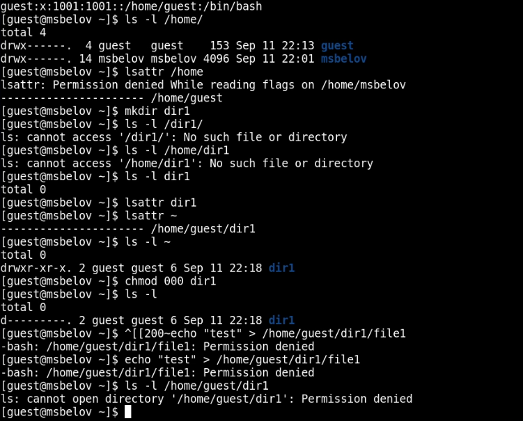

---
## Front matter
lang: ru-RU
title: Лабораторная работа №2
subtitle: Дискреционное разграничение прав в Linux. Основные атрибуты
author:
  - Белов М. С.
institute:
  - Российский университет дружбы народов, Москва, Россия
date: 11 сентября 2024

## i18n babel
babel-lang: russian
babel-otherlangs: english
mainfont: Arial
monofont: Courier New
fontsize: 12pt

## Formatting pdf
toc: false
toc-title: Содержание
slide_level: 2
aspectratio: 169
section-titles: true
theme: metropolis
header-includes:
 - \metroset{progressbar=frametitle,sectionpage=progressbar,numbering=fraction}
---

# Задача

Получение практических навыков работы в консоли с атрибутами файлов, закрепление теоретических основ дискреционного разграничения доступа в современных системах с открытым кодом на базе ОС Linux

# Выполнение лабораторной работы

## Пользователь guest

1. Создадим пользователя guest, войдем в систему от его имени, определим директорию, в которой мы находимся с помощью **pwd**. Убедившись, что мы находимся в домашней директории, уточним имя нашего пользователя, а также его группу, uid и gid.

## Пользователь guest

## Права каталога

2. Просмотрим файл /etc/passwd и найдем в нем нашего пользователя guest. Определим существующие в системе директории. Для обоих директорий установлены права 700. Создадим в домашнем каталоге подкаталог dir1. Для этого подкаталога определим права - 755. Затем, снимем с директории dir1 все атрибуты и попытаемся создать там файл - получаем ошибку доступа. 

## Права каталога

## Таблица "Минимальные права для совершения операций"

   | Операция               | Минимальные права  на директорию | Минимальные права на файл |
   | ---------------------- | -------------------------------- | ------------------------- |
   | Создание файла         | 300                              | 0                         |
   | Удаление файла         | 300                              | 0                         |
   | Чтение файла           | 100                              | 400                       |
   | Запись в файл          | 100                              | 200                       |
   | Переименование файла   | 300                              | 0                         |
   | Создание поддиректории | 300                              | 0                         |
   | Удаление поддиректории | 300                              | 0                         |

# Вывод

В ходе работы я получил практические навыки работы в консоли с атрибутами файлов, закрепление теоретических основ дискреционного разграничения доступа в современных системах с открытым кодом на базе ОС Linux.

