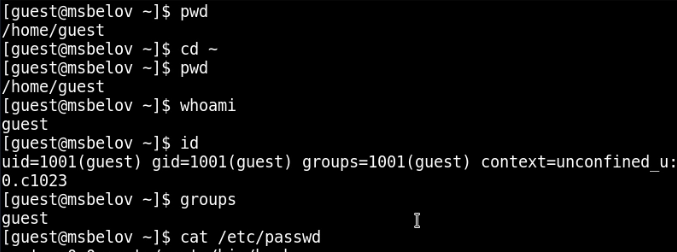
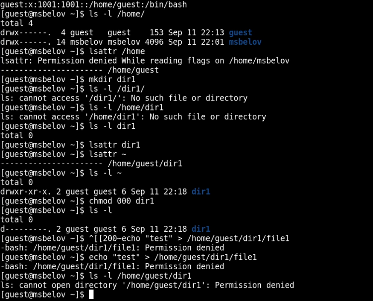

---
## Front matter
title: "Лабораторная работа №2"
subtitle: "Дискреционное разграничение прав в Linux. Основные атрибуты"
author: "Белов Максим Сергеевич, НПИбд-01-21"

## Generic otions
lang: ru-RU
toc-title: "Содержание"

## Bibliography
bibliography: bib/cite.bib
csl: pandoc/csl/gost-r-7-0-5-2008-numeric.csl

## Pdf output format
toc: true # Table of contents
toc-depth: 2
lof: true # List of figures
lot: true # List of tables
fontsize: 12pt
linestretch: 1.5
papersize: a4
documentclass: scrreprt
## I18n polyglossia
polyglossia-lang:
  name: russian
  options:
	- spelling=modern
	- babelshorthands=true
polyglossia-otherlangs:
  name: english
## I18n babel
babel-lang: russian
babel-otherlangs: english
## Fonts
mainfont: Times New Roman
romanfont: PT Serif
sansfont: DejaVu Sans
monofont: DejaVu Sans Mono
mainfontoptions: Ligatures=TeX
romanfontoptions: Ligatures=TeX
sansfontoptions: Ligatures=TeX,Scale=MatchLowercase
monofontoptions: Scale=MatchLowercase,Scale=0.9
## Biblatex
biblatex: true
biblio-style: "gost-numeric"
biblatexoptions:
  - parentracker=true
  - backend=biber
  - hyperref=auto
  - language=auto
  - autolang=other*
  - citestyle=gost-numeric
## Pandoc-crossref LaTeX customization
figureTitle: "Рис."
tableTitle: "Таблица"
listingTitle: "Листинг"
lofTitle: "Список иллюстраций"
lotTitle: "Список таблиц"
lolTitle: "Листинги"
## Misc options
indent: true
header-includes:
  - \usepackage{indentfirst}
  - \usepackage{float} # keep figures where there are in the text
  - \floatplacement{figure}{H} # keep figures where there are in the text
---

# Цель работы

Получение практических навыков работы в консоли с атрибутами файлов, закрепление теоретических основ дискреционного разграничения доступа в современных системах с открытым кодом на базе ОС Linux

# Задание

1. В установленной при выполнении предыдущей лабораторной работы
операционной системе создайте учётную запись пользователя guest (использую учётную запись администратора):
useradd guest
2. Задайте пароль для пользователя guest (использую учётную запись администратора):
passwd guest
3. Войдите в систему от имени пользователя guest.
4. Определите директорию, в которой вы находитесь, командой pwd. Сравните её с приглашением командной строки. Определите, является ли она
вашей домашней директорией? Если нет, зайдите в домашнюю директорию.
5. Уточните имя вашего пользователя командой whoami.
6. Уточните имя вашего пользователя, его группу, а также группы, куда входит пользователь, командой id. Выведенные значения uid, gid и др. запомните. Сравните вывод id с выводом команды groups.
7. Сравните полученную информацию об имени пользователя с данными,
выводимыми в приглашении командной строки.
8. Просмотрите файл /etc/passwd командой
cat /etc/passwd
Найдите в нём свою учётную запись. Определите uid пользователя.
Определите gid пользователя. Сравните найденные значения с полученными в предыдущих пунктах.
Замечание: в случае, когда вывод команды не умещается на одном
экране монитора, используйте прокрутку вверх–вниз (удерживая клавишу shift, нажимайте page up и page down) либо программу grep в качестве фильтра для вывода только строк, содержащих определённые
буквенные сочетания:
cat /etc/passwd | grep guest
9. Определите существующие в системе директории командой
ls -l /home/
Удалось ли вам получить список поддиректорий директории /home? Какие права установлены на директориях?
10. Проверьте, какие расширенные атрибуты установлены на поддиректориях, находящихся в директории /home, командой:
lsattr /home
Удалось ли вам увидеть расширенные атрибуты директории?
Удалось ли вам увидеть расширенные атрибуты директорий других
пользователей?
11. Создайте в домашней директории поддиректорию dir1 командой
mkdir dir1
Определите командами ls -l и lsattr, какие права доступа и расширенные атрибуты были выставлены на директорию dir1.
12. Снимите с директории dir1 все атрибуты командой
chmod 000 dir1
и проверьте с её помощью правильность выполнения команды
ls -l
13. Попытайтесь создать в директории dir1 файл file1 командой
echo "test" > /home/guest/dir1/file1
Объясните, почему вы получили отказ в выполнении операции по созданию файла?
Оцените, как сообщение об ошибке отразилось на создании файла? Проверьте командой
ls -l /home/guest/dir1 действительно ли файл file1 не находится внутри директории dir1
14. Заполните таблицу «Установленные права и разрешённые действия»
15. На основании заполненной таблицы определите те или иные минимально необходимые права для выполнения операций внутри директории
dir1

# Выполнение лабораторной работы

1. Создадим пользователя guest, войдем в систему от его имени, определим директорию, в которой мы находимся с помощью **pwd**. Убедившись, что мы находимся в домашней директории, уточним имя нашего пользователя, а также его группу, uid и gid.

{ #fig:001 width=100% }

2. Просмотрим файл /etc/passwd и найдем в нем нашего пользователя guest. Определим существующие в системе директории. Для обоих директорий установлены права 700. Создадим в домашнем каталоге подкаталог dir1. Для этого подкаталога определим права - 755. Затем, снимем с директории dir1 все атрибуты и попытаемся создать там файл - получаем ошибку доступа. 

{ #fig:002 width=100% }

3. Заполним таблицу «Установленные права и разрешённые действия»:

   | Права директории | Права файла | Создание файла | Удаление файла | Запись в файл | Чтение файла | Смена директории | Просмотр файлов в директории | Переименование файла | Смена атрибутов файла |
   | ---------------- | ----------- | -------------- | -------------- | ------------- | ------------ | ---------------- | ---------------------------- | -------------------- | --------------------- |
   |                  |             | touch          | rm             | echo          | cat          | cd               | ls                           | mv                   | chmod                 |
   | 0                | 0           | -              | -              | -             | -            | -                | -                            | -                    | -                     |
   | 0                | 100         | -              | -              | -             | -            | -                | -                            | -                    | -                     |
   | 0                | 200         | -              | -              | -             | -            | -                | -                            | -                    | -                     |
   | 0                | 300         | -              | -              | -             | -            | -                | -                            | -                    | -                     |
   | 0                | 400         | -              | -              | -             | -            | -                | -                            | -                    | -                     |
   | 0                | 500         | -              | -              | -             | -            | -                | -                            | -                    | -                     |
   | 0                | 600         | -              | -              | -             | -            | -                | -                            | -                    | -                     |
   | 0                | 700         | -              | -              | -             | -            | -                | -                            | -                    | -                     |
   | 100              | 0           | -              | -              | -             | -            | +                | -                            | -                    | +                     |
   | 100              | 100         | -              | -              | -             | -            | +                | -                            | -                    | +                     |
   | 100              | 200         | -              | -              | +             | -            | +                | -                            | -                    | +                     |
   | 100              | 300         | -              | -              | +             | -            | +                | -                            | -                    | +                     |
   | 100              | 400         | -              | -              | +             | +            | +                | -                            | -                    | +                     |
   | 100              | 500         | -              | -              | +             | +            | +                | -                            | -                    | +                     |
   | 100              | 600         | -              | -              | +             | +            | +                | -                            | -                    | +                     |
   | 100              | 700         | -              | -              | +             | +            | +                | -                            | -                    | +                     |
   | 200              | 0           | -              | -              | -             | -            | -                | -                            | -                    | -                     |
   | 200              | 100         | -              | -              | -             | -            | -                | -                            | -                    | -                     |
   | 200              | 200         | -              | -              | -             | -            | -                | -                            | -                    | -                     |
   | 200              | 300         | -              | -              | -             | -            | -                | -                            | -                    | -                     |
   | 200              | 400         | -              | -              | -             | -            | -                | -                            | -                    | -                     |
   | 200              | 500         | -              | -              | -             | -            | -                | -                            | -                    | -                     |
   | 200              | 600         | -              | -              | -             | -            | -                | -                            | -                    | -                     |
   | 200              | 700         | -              | -              | -             | -            | -                | -                            | -                    | -                     |
   | 300              | 0           | +              | +              | -             | -            | +                | -                            | +                    | +                     |
   | 300              | 100         | +              | +              | -             | -            | +                | -                            | +                    | +                     |
   | 300              | 200         | +              | +              | +             | -            | +                | -                            | +                    | +                     |
   | 300              | 300         | +              | +              | +             | -            | +                | -                            | +                    | +                     |
   | 300              | 400         | +              | +              | +             | +            | +                | -                            | +                    | +                     |
   | 300              | 500         | +              | +              | +             | +            | +                | -                            | +                    | +                     |
   | 300              | 600         | +              | +              | +             | +            | +                | -                            | +                    | +                     |
   | 300              | 700         | +              | +              | +             | +            | +                | -                            | +                    | +                     |
   | 400              | 0           | -              | -              | -             | -            | -                | +                            | -                    | -                     |
   | 400              | 100         | -              | -              | -             | -            | -                | +                            | -                    | -                     |
   | 400              | 200         | -              | -              | -             | -            | -                | +                            | -                    | -                     |
   | 400              | 300         | -              | -              | -             | -            | -                | +                            | -                    | -                     |
   | 400              | 400         | -              | -              | -             | -            | -                | +                            | -                    | -                     |
   | 400              | 500         | -              | -              | -             | -            | -                | +                            | -                    | -                     |
   | 400              | 600         | -              | -              | -             | -            | -                | +                            | -                    | -                     |
   | 400              | 700         | -              | -              | -             | -            | -                | +                            | -                    | -                     |
   | 500              | 0           | -              | -              | -             | +            | +                | +                            | -                    | +                     |
   | 500              | 100         | -              | -              | -             | +            | +                | +                            | -                    | +                     |
   | 500              | 200         | -              | -              | +             | +            | +                | +                            | -                    | +                     |
   | 500              | 300         | -              | -              | +             | +            | +                | +                            | -                    | +                     |
   | 500              | 400         | -              | -              | +             | +            | +                | +                            | -                    | +                     |
   | 500              | 500         | -              | -              | +             | +            | +                | +                            | -                    | +                     |
   | 500              | 600         | -              | -              | +             | +            | +                | +                            | -                    | +                     |
   | 500              | 700         | -              | -              | +             | +            | +                | +                            | -                    | +                     |
   | 600              | 0           | -              | -              | -             | -            | -                | +                            | -                    | -                     |
   | 600              | 100         | -              | -              | -             | -            | -                | +                            | -                    | -                     |
   | 600              | 200         | -              | -              | -             | -            | -                | +                            | -                    | -                     |
   | 600              | 300         | -              | -              | -             | -            | -                | +                            | -                    | -                     |
   | 600              | 400         | -              | -              | -             | -            | -                | +                            | -                    | -                     |
   | 600              | 500         | -              | -              | -             | -            | -                | +                            | -                    | -                     |
   | 600              | 600         | -              | -              | -             | -            | -                | +                            | -                    | -                     |
   | 600              | 700         | -              | -              | -             | -            | -                | +                            | -                    | -                     |
   | 700              | 0           | +              | +              | +             | -            | +                | +                            | +                    | +                     |
   | 700              | 100         | +              | +              | +             | -            | +                | +                            | +                    | +                     |
   | 700              | 200         | +              | +              | +             | -            | +                | +                            | +                    | +                     |
   | 700              | 300         | +              | +              | +             | -            | +                | +                            | +                    | +                     |
   | 700              | 400         | +              | +              | +             | +            | +                | +                            | +                    | +                     |
   | 700              | 500         | +              | +              | +             | +            | +                | +                            | +                    | +                     |
   | 700              | 600         | +              | +              | +             | +            | +                | +                            | +                    | +                     |
   | 700              | 700         | +              | +              | +             | +            | +                | +                            | +                    | +                     |

4. Заполним таблицу "Минимальные права для совершения операций"

   | Операция               | Минимальные права  на директорию | Минимальные права на файл |
   | ---------------------- | -------------------------------- | ------------------------- |
   | Создание файла         | 300                              | 0                         |
   | Удаление файла         | 300                              | 0                         |
   | Чтение файла           | 100                              | 400                       |
   | Запись в файл          | 100                              | 200                       |
   | Переименование файла   | 300                              | 0                         |
   | Создание поддиректории | 300                              | 0                         |
   | Удаление поддиректории | 300                              | 0                         |

# Вывод

В ходе работы я получил практические навыки работы в консоли с атрибутами файлов, закрепление теоретических основ дискреционного разграничения доступа в современных системах с открытым кодом на базе ОС Linux.