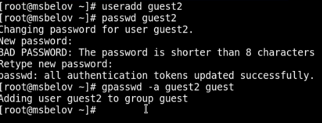
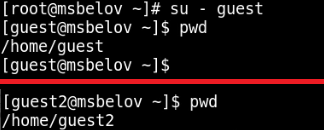
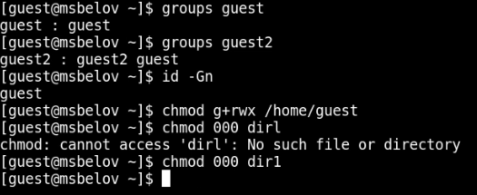

---
## Front matter
lang: ru-RU
title: Лабораторная работа №3
subtitle: Дискреционное разграничение прав в Linux. Два пользователя
author:
  - Белов М. С.
institute:
  - Российский университет дружбы народов, Москва, Россия
date: 16 сентября 2024

## i18n babel
babel-lang: russian
babel-otherlangs: english
mainfont: Arial
monofont: Courier New
fontsize: 12pt

## Formatting pdf
toc: false
toc-title: Содержание
slide_level: 2
aspectratio: 169
section-titles: true
theme: metropolis
header-includes:
 - \metroset{progressbar=frametitle,sectionpage=progressbar,numbering=fraction}
---

# Задача

Получение практических навыков работы в консоли с атрибутами файлов для групп пользователей.

# Выполнение лабораторной работы

## Работа с консолью

Создадим учетные записи двух пользователей - guest (создали в прошлой лабораторной работе) и guest2. Зададим пароль и добавим пользователя guest2 к группе guest.

{#fig:001 width=70%}

## Работа с консолью

{#fig:002 width=70%}

## Работа с консолью

Проверим группы, в которых находятся пользователи guest и guest2. От имени пользователя guest изменим права директории /home/guest, разрешив все действия для пользователей группы. От имени пользователя guest снимем с директории /home/guest/dir1 все атрибуты::

## Работа с консолью

{#fig:003 width=70%}

# Таблица

## Минимальные права для совершения операций

   | Операция               | Минимальные права  на директорию | Минимальные права на файл |
   | ---------------------- | -------------------------------- | ------------------------- |
   | Создание файла         | 030                              | 0                         |
   | Удаление файла         | 030                              | 0                         |
   | Чтение файла           | 010                              | 040                       |
   | апись в файл           | 010                              | 020                       |
   | Переименование файла   | 030                              | 0                         |
   | Создание поддиректории | 030                              | 0                         |
   | Удаление поддиректории | 030                              | 0

# Вывод

В ходе работы я получил практические навыки работы в консоли с атрибутами файлов для групп пользователей..

