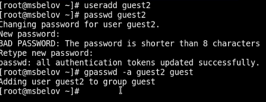
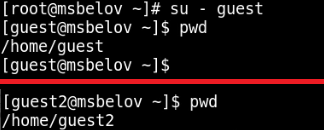
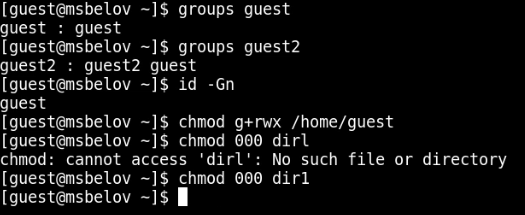

---
## Front matter
title: "Лабораторная работа №3"
subtitle: "Дискреционное разграничение прав в Linux. Два пользователя"
author: "Белов Максим Сергеевич, НПИбд-01-21"

## Generic otions
lang: ru-RU
toc-title: "Содержание"

## Bibliography
bibliography: bib/cite.bib
csl: pandoc/csl/gost-r-7-0-5-2008-numeric.csl

## Pdf output format
toc: true # Table of contents
toc-depth: 2
lof: true # List of figures
lot: true # List of tables
fontsize: 12pt
linestretch: 1.5
papersize: a4
documentclass: scrreprt
## I18n polyglossia
polyglossia-lang:
  name: russian
  options:
	- spelling=modern
	- babelshorthands=true
polyglossia-otherlangs:
  name: english
## I18n babel
babel-lang: russian
babel-otherlangs: english
## Fonts
mainfont: Times New Roman
romanfont: PT Serif
sansfont: DejaVu Sans
monofont: DejaVu Sans Mono
mainfontoptions: Ligatures=TeX
romanfontoptions: Ligatures=TeX
sansfontoptions: Ligatures=TeX,Scale=MatchLowercase
monofontoptions: Scale=MatchLowercase,Scale=0.9
## Biblatex
biblatex: true
biblio-style: "gost-numeric"
biblatexoptions:
  - parentracker=true
  - backend=biber
  - hyperref=auto
  - language=auto
  - autolang=other*
  - citestyle=gost-numeric
## Pandoc-crossref LaTeX customization
figureTitle: "Рис."
tableTitle: "Таблица"
listingTitle: "Листинг"
lofTitle: "Список иллюстраций"
lotTitle: "Список таблиц"
lolTitle: "Листинги"
## Misc options
indent: true
header-includes:
  - \usepackage{indentfirst}
  - \usepackage{float} # keep figures where there are in the text
  - \floatplacement{figure}{H} # keep figures where there are in the text
---

# Цель работы

Получение практических навыков работы в консоли с атрибутами файлов для групп пользователей

# Задание

1. В установленной операционной системе создайте учётную запись пользователя guest (использую учётную запись администратора):
useradd guest

2. Задайте пароль для пользователя guest (использую учётную запись администратора):
passwd guest

3. Аналогично создайте второго пользователя guest2.

4. Добавьте пользователя guest2 в группу guest:
gpasswd -a guest2 guest

5. Осуществите вход в систему от двух пользователей на двух разных консолях: guest на первой консоли и guest2 на второй консоли.

6. Для обоих пользователей командой pwd определите директорию, в которой вы находитесь. Сравните её с приглашениями командной строки.

7. Уточните имя вашего пользователя, его группу, кто входит в неё
и к каким группам принадлежит он сам. Определите командами
groups guest и groups guest2, в какие группы входят пользователи guest и guest2. Сравните вывод команды groups с выводом команд
id -Gn и id -G.

8. Сравните полученную информацию с содержимым файла /etc/group.
Просмотрите файл командой
cat /etc/group

9. От имени пользователя guest2 выполните регистрацию пользователя
guest2 в группе guest командой
newgrp guest

10. От имени пользователя guest измените права директории /home/guest,
разрешив все действия для пользователей группы:
chmod g+rwx /home/guest

11. От имени пользователя guest снимите с директории /home/guest/dir1
все атрибуты командой
chmod 000 dirl

# Выполнение лабораторной работы

## Работа с консолью

1. Создадим учетные записи двух пользователей - guest (создали в прошлой лабораторной работе) и guest2. Зададим пароль и добавим пользователя guest2 к группе guest.

{ #fig:001 width=100% }

2. Для обоих пользователей проверим директорию, в которой они находятся с помощью **pwd**:

{ #fig:002 width=100% }

3. Проверим группы, в которых находятся пользователи guest и guest2. От имени пользователя guest изменим права директории /home/guest, разрешив все действия для пользователей группы. От имени пользователя guest снимем с директории /home/guest/dir1 все атрибуты:

{ #fig:003 width=100% }
 
## Таблицы

Таблица "Установленные права и разрешённые действия для групп":

: Установленные права и разрешённые действия для групп {#tbl:priv}

 |                  |             |                |                |               |              |                  |                              |                      |                       |
   | ---------------- | ----------- | -------------- | -------------- | ------------- | ------------ | ---------------- | ---------------------------- | -------------------- | --------------------- |
   | Права директории | Права файла | Создание файла | Удаление файла | Запись в файл | Чтение файла | Смена директории | Просмотр файлов в директории | Переименование файла | Смена атрибутов файла |
   | 0                | 0           | -              | -              | -             | -            | -                | -                            |                      |                       |
   | 0                | 10          | -              | -              | -             | -            | -                | -                            | -                    | -                     |
   | 0                | 20          | -              | -              | -             | -            | -                | -                            | -                    | -                     |
   | 0                | 30          | -              | -              | -             | -            | -                | -                            | -                    | -                     |
   | 0                | 40          | -              | -              | -             | -            | -                | -                            | -                    | -                     |
   | 0                | 50          | -              | -              | -             | -            | -                | -                            | -                    | -                     |
   | 0                | 60          | -              | -              | -             | -            | -                | -                            | -                    | -                     |
   | 0                | 70          | -              | -              | -             | -            | -                | -                            | -                    | -                     |
   | 10               | 0           | -              | -              | -             | -            | +                | -                            | -                    | -                     |
   | 10               | 10          | -              | -              | -             | -            | +                | -                            | -                    | -                     |
   | 10               | 20          | -              | -              | -             | -            | +                | -                            | -                    | -                     |
   | 10               | 30          | -              | -              | -             | -            | +                | -                            | -                    | -                     |
   | 10               | 40          | -              | -              | -             | -            | +                | -                            | -                    | -                     |
   | 10               | 50          | -              | -              | -             | -            | +                | -                            | -                    | -                     |
   | 10               | 60          | -              | -              | -             | -            | +                | -                            | -                    | -                     |
   | 10               | 70          | -              | -              | -             | -            | +                | -                            | -                    | -                     |
   | 20               | 0           | -              | -              | -             | -            | -                | -                            | -                    | -                     |
   | 20               | 10          | -              | -              | -             | -            | -                | -                            | -                    | -                     |
   | 20               | 20          | -              | -              | -             | -            | -                | -                            | -                    | -                     |
   | 20               | 30          | -              | -              | -             | -            | -                | -                            | -                    | -                     |
   | 20               | 40          | -              | -              | -             | -            | -                | -                            | -                    | -                     |
   | 20               | 50          | -              | -              | -             | -            | -                | -                            | -                    | -                     |
   | 20               | 60          | -              | -              | -             | -            | -                | -                            | -                    | -                     |
   | 20               | 70          | -              | -              | -             | -            | -                | -                            | -                    | -                     |
   | 30               | 0           | +              | +              | -             | -            | +                | -                            | +                    | +                     |
   | 30               | 10          | +              | +              | -             | -            | +                | -                            | +                    | +                     |
   | 30               | 20          | +              | +              | +             | -            | +                | -                            | +                    | +                     |
   | 30               | 30          | +              | +              | +             | -            | +                | -                            | +                    | +                     |
   | 30               | 40          | +              | +              | +             | +            | +                | -                            | +                    | +                     |
   | 30               | 50          | +              | +              | +             | +            | +                | -                            | +                    | +                     |
   | 30               | 60          | +              | +              | +             | +            | +                | -                            | +                    | +                     |
   | 30               | 70          | +              | +              | +             | +            | +                | -                            | +                    | +                     |
   | 40               | 0           | -              | -              | -             | -            | -                | +                            | -                    | -                     |
   | 40               | 10          | -              | -              | -             | -            | -                | +                            | -                    | -                     |
   | 40               | 20          | -              | -              | -             | -            | -                | +                            | -                    | -                     |
   | 40               | 30          | -              | -              | -             | -            | -                | +                            | -                    | -                     |
   | 40               | 40          | -              | -              | -             | -            | -                | +                            | -                    | -                     |
   | 40               | 50          | -              | -              | -             | -            | -                | +                            | -                    | -                     |
   | 40               | 60          | -              | -              | -             | -            | -                | +                            | -                    | -                     |
   | 40               | 70          | -              | -              | -             | -            | -                | +                            | -                    | -                     |
   | 50               | 0           | -              | -              | -             | +            | +                | +                            | -                    | +                     |
   | 50               | 10          | -              | -              | -             | +            | +                | +                            | -                    | +                     |
   | 50               | 20          | -              | -              | +             | +            | +                | +                            | -                    | +                     |
   | 50               | 30          | -              | -              | +             | +            | +                | +                            | -                    | +                     |
   | 50               | 40          | -              | -              | +             | +            | +                | +                            | -                    | +                     |
   | 50               | 50          | -              | -              | +             | +            | +                | +                            | -                    | +                     |
   | 50               | 60          | -              | -              | +             | +            | +                | +                            | -                    | +                     |
   | 50               | 70          | -              | -              | +             | +            | +                | +                            | -                    | +                     |
   | 60               | 0           | -              | -              | -             | -            | -                | +                            | -                    | -                     |
   | 60               | 10          | -              | -              | -             | -            | -                | +                            | -                    | -                     |
   | 60               | 20          | -              | -              | -             | -            | -                | +                            | -                    | -                     |
   | 60               | 30          | -              | -              | -             | -            | -                | +                            | -                    | -                     |
   | 60               | 40          | -              | -              | -             | -            | -                | +                            | -                    | -                     |
   | 60               | 50          | -              | -              | -             | -            | -                | +                            | -                    | -                     |
   | 60               | 60          | -              | -              | -             | -            | -                | +                            | -                    | -                     |
   | 60               | 70          | -              | -              | -             | -            | -                | +                            | -                    | -                     |
   | 70               | 0           | +              | +              | -             | -            | +                | +                            | +                    | +                     |
   | 70               | 10          | +              | +              | -             | -            | +                | +                            | +                    | +                     |
   | 70               | 20          | +              | +              | -             | -            | +                | +                            | +                    | +                     |
   | 70               | 30          | +              | +              | -             | -            | +                | +                            | +                    | +                     |
   | 70               | 40          | +              | +              | -             | -            | +                | +                            | +                    | +                     |
   | 70               | 50          | +              | +              | -             | -            | +                | +                            | +                    | +                     |
   | 70               | 60          | +              | +              | -             | -            | +                | +                            | +                    | +                     |
   | 70               | 70          | +              | +              | -             | -            | +                | +                            | +                    | +                     |

: Минимальные права для совершения операций {#tbl:min}

   | Операция               | Минимальные права  на директорию | Минимальные права на файл |
   | ---------------------- | -------------------------------- | ------------------------- |
   | Создание файла         | 030                              | 0                         |
   | Удаление файла         | 030                              | 0                         |
   | Чтение файла           | 010                              | 040                       |
   | апись в файл           | 010                              | 020                       |
   | Переименование файла   | 030                              | 0                         |
   | Создание поддиректории | 030                              | 0                         |
   | Удаление поддиректории | 030                              | 0                         |

# Вывод

В ходе работы я получил практические навыки работы в консоли с атрибутами файлов для групп пользователей.

