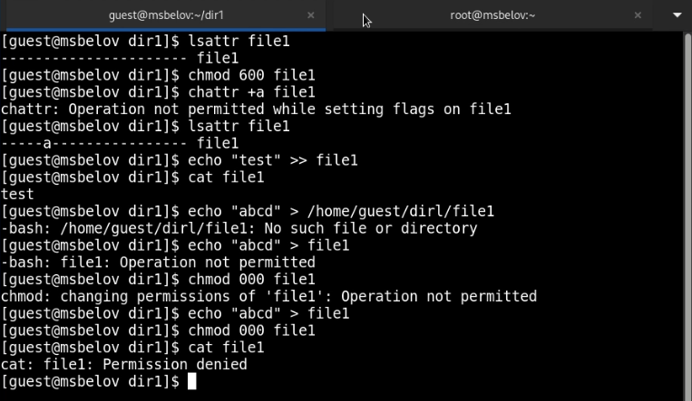
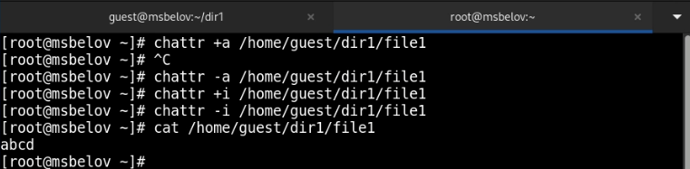

---
## Front matter
lang: ru-RU
title: Лабораторная работа №4
subtitle: Дискреционное разграничение прав в Linux. Расширенные атрибуты
author:
  - Белов М. С.
institute:
  - Российский университет дружбы народов, Москва, Россия
date: 28 сентября 2024

## i18n babel
babel-lang: russian
babel-otherlangs: english
mainfont: Arial
monofont: Courier New
fontsize: 12pt

## Formatting pdf
toc: false
toc-title: Содержание
slide_level: 2
aspectratio: 169
section-titles: true
theme: metropolis
header-includes:
 - \metroset{progressbar=frametitle,sectionpage=progressbar,numbering=fraction}
---

# Задача

Получение практических навыков работы в консоли с расширенными
атрибутами файлов.

# Выполнение лабораторной работы

## Атрибуты

1. От имени пользователя **guest** определим расширенные атрибуты файла
/home/guest/dir1/file1. Установим командой *chmod 600 file1* на файл *file1* права, разрешающие чтение и запись для владельца файла. Установим расширенный атрибут a на файл /home/guest/dir1/file1 от имени суперпользователя. От пользователя guest проверьте правильность установления атрибута. Выполните дозапись в файл file1 слова «test». После этого выполните чтение файла file1 и убедимся, что слово 'test' успешно записано в файл.

## Атрибуты
{ #fig:001 width=70% }

## Смена атрибутов от имени суперпользователя

{ #fig:002 width=70% }

# Вывод

В ходе работы я получил практические навыки работы в консоли с расширенными
атрибутами файлов.

