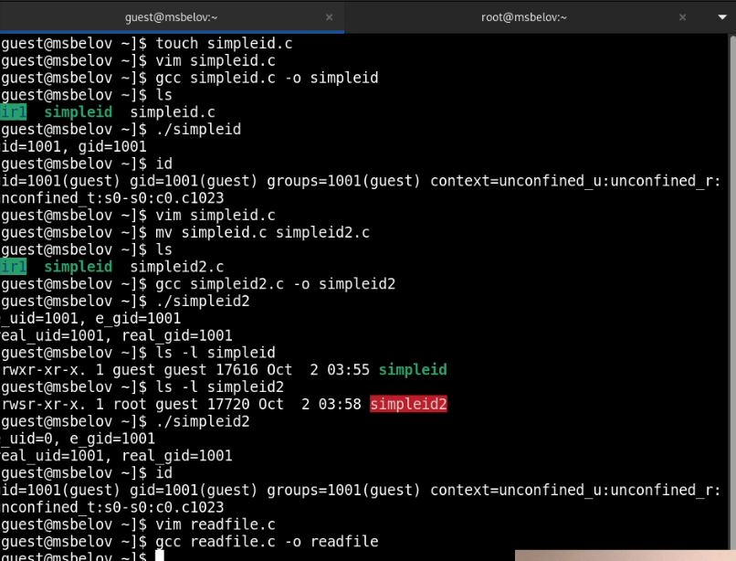
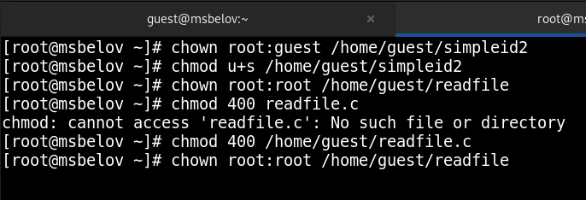
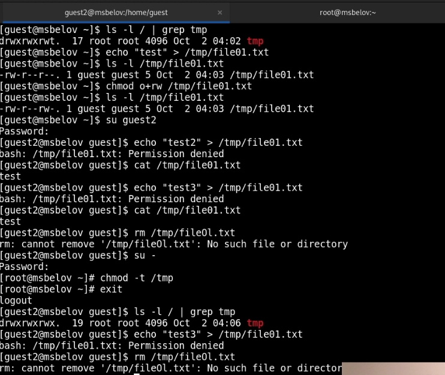

---
## Front matter
lang: ru-RU
title: Лабораторная работа №5
subtitle: Дискреционное разграничение прав в Linux. Исследование влияния дополнительных атрибуто
author:
  - Белов М. С.
institute:
  - Российский университет дружбы народов, Москва, Россия
date: 2 октября 2024

## i18n babel
babel-lang: russian
babel-otherlangs: english
mainfont: Arial
monofont: Courier New
fontsize: 12pt

## Formatting pdf
toc: false
toc-title: Содержание
slide_level: 2
aspectratio: 169
section-titles: true
theme: metropolis
header-includes:
 - \metroset{progressbar=frametitle,sectionpage=progressbar,numbering=fraction}
---

# Задача

Изучение механизмов изменения идентификаторов, применения SetUID- и Sticky-битов. Получение практических навыков работы в консоли с дополнительными атрибутами. Рассмотрение работы механизма
смены идентификатора процессов пользователей, а также влияние бита
Sticky на запись и удаление файлов.

# Выполнение лабораторной работы

## Создание программы

1. От имени пользователя *guest* создадим две программы *simpleid* и *simpleid2*. Также создадим программу *readfile*

{ #fig:001 width=70% }

## Создание программы

От имени суперпользователя выполним некоторые команды и проверим их работу:

{ #fig:002 width=70% }

## Исследование Sticky-бита
 
2. Выясним установлен ли атрибут Sticky на директории /tmp. От имени пользователя guest создайдим файл file01.txt в директории /tmp
со словом test. Просмотрим атрибуты у только что созданного файла и разрешим чтение и запись для категории пользователей «все остальные». Также попробуем снять атрибут *t*.

## Исследование Sticky-бита

{ #fig:003 width=70% }

# Вывод

В ходе работы я изучил механизмы изменения идентификаторов, применения SetUID- и Sticky-битов. Получил практическе навыки работы в консоли с дополнительными атрибутами. Рассмотрел работы механизма смены идентификатора процессов пользователей, а также влияние бита Sticky на запись и удаление файлов.

