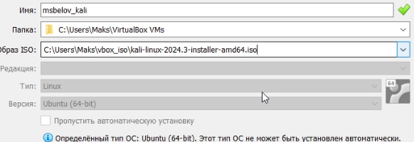
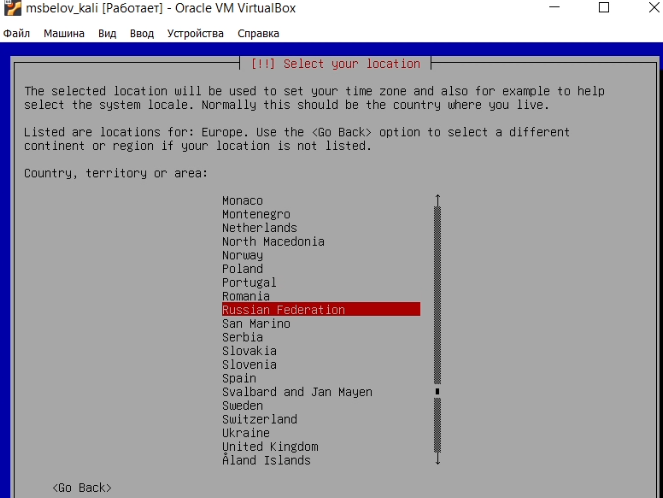
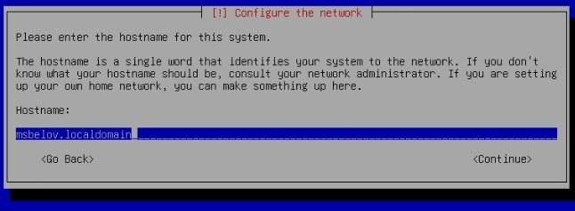
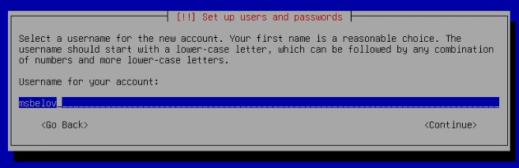
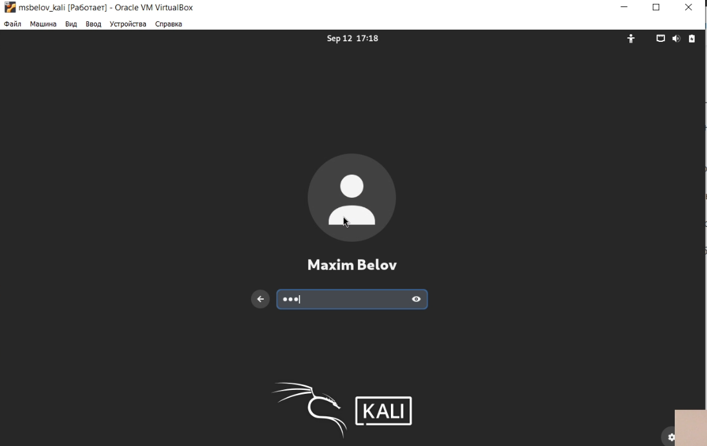
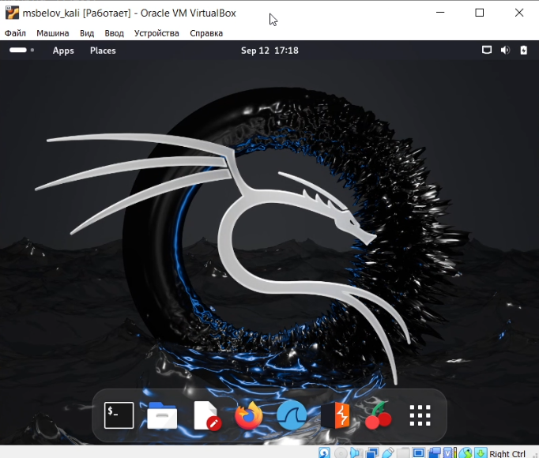

---
## Front matter
lang: ru-RU
title: Индивидуальный проект
subtitle: Этап 1. Установка Kali Linux
author:
  - Белов М. С.
institute:
  - Российский университет дружбы народов, Москва, Россия
date: 12 сентября 2024

## i18n babel
babel-lang: russian
babel-otherlangs: english
mainfont: Arial
monofont: Courier New
fontsize: 12pt

## Formatting pdf
toc: false
toc-title: Содержание
slide_level: 2
aspectratio: 169
section-titles: true
theme: metropolis
header-includes:
 - \metroset{progressbar=frametitle,sectionpage=progressbar,numbering=fraction}
---

# Задача

Целью данной работы является установка Kali Linux в VirtualBox.

# Выполнение лабораторной работы

## Установка Kali Linux

1. Создадим новую виртуальную машину. Укажем имя виртуальной машины **msbelov_kali**. Укажем размер основной памяти виртуальной машины — 2048 МБ. Зададим размер диска — 40 ГБ. После этого запустим виртуальную машину и скорректируем параметры установки.

{ #fig:001 width=100% }

## Установка Kali Linux

2. Выберем наше местоположение

## Установка Kali Linux

3. Напишем имя хоста - **msbelov.localdomain**

## Установка Kali Linux

4. Напишем имя пользователя - **msbelov**

## Установка Kali Linux

5. После успешной установки, авторизуемся в систему.

## Установка Kali Linux

# Вывод

В ходе работы я установил Kali Linux в VirtualBox.

