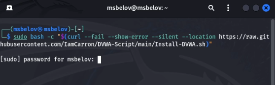
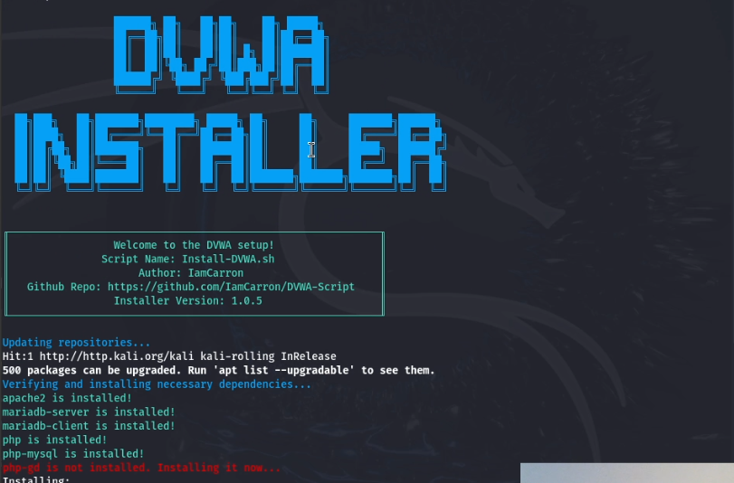
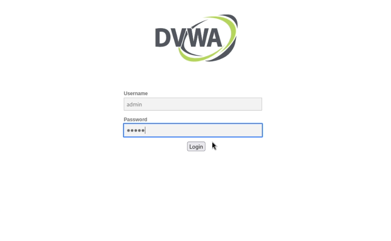
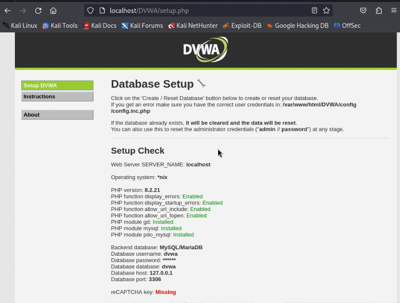

---
## Front matter
lang: ru-RU
title: Индивидуальный проект
subtitle: Этап 2. Установка DVWA
author:
  - Белов М. С.
institute:
  - Российский университет дружбы народов, Москва, Россия
date: 16 сентября 2024

## i18n babel
babel-lang: russian
babel-otherlangs: english
mainfont: Arial
monofont: Courier New
fontsize: 12pt

## Formatting pdf
toc: false
toc-title: Содержание
slide_level: 2
aspectratio: 169
section-titles: true
theme: metropolis
header-includes:
 - \metroset{progressbar=frametitle,sectionpage=progressbar,numbering=fraction}
---

# Задача

Установить DVWA в гостевую систему к Kali Linux.

# Выполнение лабораторной работы

## Установка DVWA

Установим DVWA с помощью скрипта, написанного [IamCarron](https://github.com/IamCarron).

{ #fig:001 width=70% }

## Установка DVWA

{ #fig:002 width=70% }

## Установка DVWA

После успешной установки авторизуемся в систему.

{ #fig:003 width=70% }

## Установка DVWA

{ #fig:004 width=70% }

# Вывод

В ходе работы я установил DVWA в гостевую систему к Kali Linux

